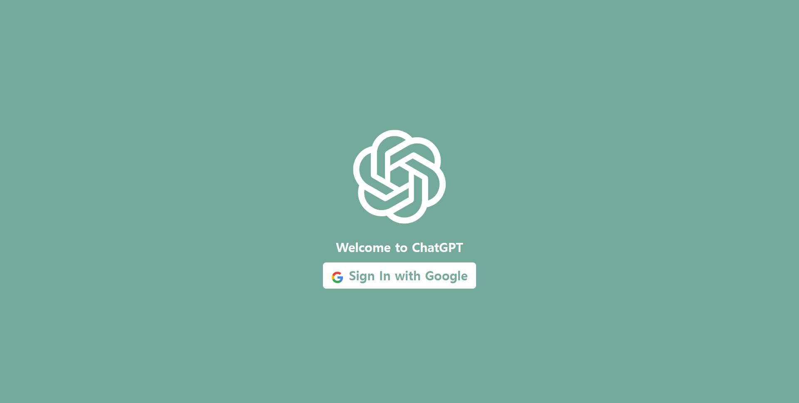
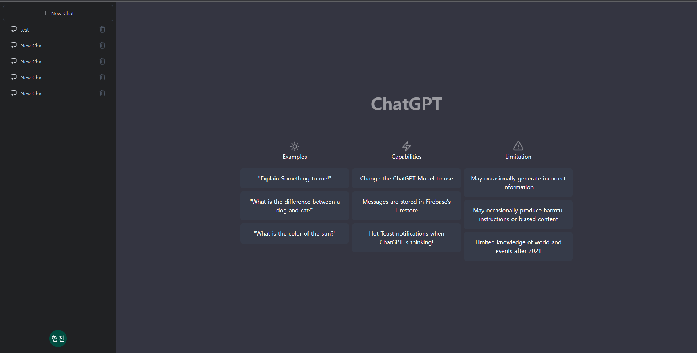

# ChatGPT Messenger

 

### `TypeScript`를 기반의 `OpenAI API`를 활용한 `ChatGPT Messenger` 프로젝트입니다.

 

# 1. Tech

- Front-End
    
  &nbsp;
  &nbsp;
  &nbsp;
  

 

<!-- - Deploy
    
      
 
-->

- Back-End
    
  &nbsp;
  

 

- Edit Tool
    
  &nbsp;
  &nbsp;
  

 

- Chat API
    
  

 

# 3. 프로젝트 상세 내용 (진행 중...)

| ChatGPT 메인 화면                 |
| --------------------------------- |
|  |

<!-- 참고 링크 : https://www.youtube.com/watch?v=V6Hq_EX2LLM&list=WL&index=9&t=742s&ab_channel=SonnySangha (2:35:50까지 진행) -->
